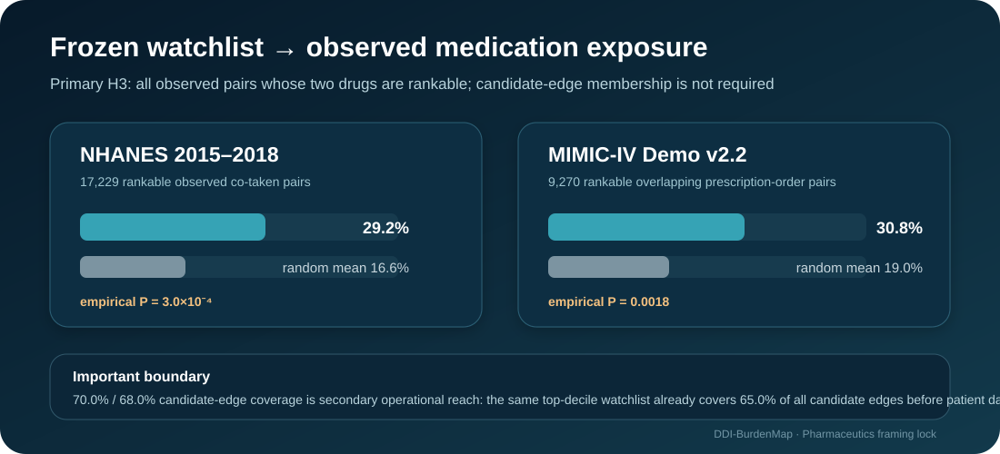

<div align="center">

# DDI-BurdenMap

### Drug-level concentration of drug–drug interaction burden across PK mechanisms and real-world medication exposure

**A mechanism-aware, independently replicated burden architecture with a drug ranking frozen before patient-data analysis.**

[](requirements.txt)
[](#evidence-stack)
[](#patient-exposure-transport)
[](#patient-exposure-transport)
[](DATA_LICENSE_NOTICE.md)

*Reproducibility repository for the Pharmaceutics submission:*  
**Drug-Level Concentration of Drug–Drug Interaction Burden Across Pharmacokinetic Mechanisms and Real-World Medication Exposure**

</div>

---

## Core idea

Most computational DDI work is pair-centered. DDI-BurdenMap asks a complementary systems-level question:

> **Is interaction burden reproducibly concentrated on a manageable subset of drugs, does that concentration persist within interpretable pharmacokinetic mechanism strata, and does a ranking fixed before patient-data analysis remain overrepresented in medication combinations observed in practice?**

The drug ranking is derived **before** NHANES or MIMIC-IV data are introduced. Patient data are therefore transport tests of a frozen drug-level structure, not inputs used to discover or tune that structure.

## Evidence stack

| Evidence layer | Main result | Inferential role |
|---|---|---|
| Fixed candidate network | 1,114 drugs; 16,316 pairs; top decile carries 42.3% of endpoints; Gini 0.637 | Discovery of drug-level burden concentration |
| Construction-reference network | top decile carries 45.1%; Gini 0.654 | Internal structural consistency |
| Independent DDInter export | 160,235 pairs; top decile carries 31.6%; Gini 0.503 | **Independent structural replication** |
| PK mechanism strata | top-decile shares: metabolism inhibition 43.1%; induction 51.6%; protein binding 44.2%; transporter inhibition 39.6% | Mechanism-aware persistence |
| NHANES 2015–2018 | frozen top-decile covers 29.2% of 17,229 rankable observed pairs vs 16.6% random-set mean; P = 3.0×10⁻⁴ | **Primary ambulatory transport test** |
| MIMIC-IV Demo v2.2 | frozen top-decile covers 30.8% of 9,270 rankable overlapping pairs vs 19.0% random-set mean; P = 0.0018 | Secondary inpatient transport/sensitivity |
| Candidate-edge operational reach | 70.0% NHANES; 68.0% MIMIC-IV, while the same watchlist covers 65.0% of all candidate edges before cohort data | Operational reach, **not** independent validation |
| ONC expert-consensus analyses | Non-Interruptive pairs are realized more often globally; watchlist-specific realized-pair contrasts are non-significant | Burden/priority separation and negative-result retention |

**Interpretation boundary:** degree is a drug-level **interaction-burden/connectivity** signal. It is not a confirmed-interaction label, pair-specific PK estimate, severity score, fired-alert measure, patient-specific risk score, or validated suppression rule.

<p align="center">
  
</p>

<p align="center">
  
</p>

## Why the patient result is framed this way

A degree-ranked top-decile watchlist mechanically covers many edges in the network from which it was derived. In this dataset it covers **65.0% of all candidate-network edges before any patient data are introduced**. Therefore, the larger 70.0%/68.0% values among observed candidate-network edges are useful measures of practical reach, but they are not treated as an independent null test.

The principal H3 analysis instead asks whether the frozen watchlist is overrepresented among **all observed medication pairs whose drugs are rankable in the candidate network**, whether or not the observed pair is itself a candidate edge. This yields:

- **NHANES:** 29.2% coverage vs 16.6% random equal-size drug-set mean (95% interval 10.8–22.8%; 10,000 draws; seed 42; empirical P = 3.0×10⁻⁴).
- **MIMIC-IV Demo:** 30.8% coverage vs 19.0% random mean (95% interval 11.7–26.9%; empirical P = 0.0018).

The corresponding 5%, 10%, and 20% watchlist analyses are retained in the submission Supplementary Information and machine-readable outputs rather than selecting a single favorable cutoff after inspection.

## Patient-exposure transport

### NHANES 2015–2018 — primary ambulatory transport

`code/nhanes_cohort_validation.py` analyzes CDC/NCHS prescription-medication data after the degree ranking is frozen. The analytical cohort contains **7,669 participants with at least one mapped prescription**; 5,301 use two or more mapped drugs. The primary denominator contains **17,229 rankable observed co-taken pairs**.

### MIMIC-IV Demo v2.2 — secondary inpatient transport/sensitivity

`code/mimic_cohort_validation.py` uses temporal overlap of **prescription-order start/stop windows** within admission. The open demo contains **100 de-identified patients and 250 admissions**. Temporal overlap produces 14,677 unique mapped pairs; **9,270 have both drugs rankable** in the candidate network.

The demo is intentionally small and is treated as a transport/sensitivity analysis, not as a second definitive clinical-effectiveness cohort. No administration-event, concentration, outcome, or alert-log claim is made.

See [`code/README_cohort_validation.md`](code/README_cohort_validation.md).

## Independent DDInter replication

DDInter provides an external interaction-resource lineage. The analysis reconstructs the pair-level edge list locally and does **not** redistribute DDInter source or processed pair-level files because DDInter states a CC BY-NC-SA 4.0 license.

```bash
python code/prepare_ddinter_from_public.py --download \
  --raw-dir data/raw_ddinter --output data/ddinter2_unique.csv

python code/ddinter_severity_analysis.py \
  data/ddinter2_unique.csv out/ddinter_severity_results.json
```

The structural result replicates, while a severity-label permutation analysis shows that degree primarily tracks total interaction burden rather than Major-severity preference.

<p align="center">
  
</p>

## ONC expert-consensus analyses

Two ONC analyses use different mapped representations from the same pinned upstream PDDI repository commit, so their denominators are intentionally kept analysis-specific.

Across patient cohorts, Non-Interruptive pairs are observed more often than High-Priority pairs at the global list level. However, the **watchlist-specific ONC contrast among realized pairs is underpowered/non-significant** (NHANES P = 0.26; MIMIC-IV Demo P = 0.80) and is retained rather than hidden.

This distinction is central to the paper: **interaction burden, expert priority, and patient-specific clinical risk are not interchangeable quantities.**

## Reproducibility

```bash
git clone https://github.com/adeebnoor/DDI-BurdenMap.git
cd DDI-BurdenMap
python -m venv .venv
source .venv/bin/activate
pip install -r requirements.txt
```

The **submission reproducibility archive is the version of record** for the exact redistributable fixed inputs, mapping file, pinned environment, scripts, and machine-readable outputs used in the manuscript. This public repository mirrors the core workflow and public-facing documentation; third-party source datasets are obtained from their custodians rather than re-hosted.

Key design choices:

- candidate-network ranking fixed before cohort analysis;
- 10,000 random equal-size drug-set nulls with documented seed 42;
- explicit 5%/10%/20% watchlist sensitivity;
- independent DDInter replication;
- PK mechanism-stratified concentration analysis;
- unconditional candidate-edge baseline reported before interpreting cohort candidate-edge coverage;
- MIMIC-IV Demo labeled as a small inpatient transport/sensitivity analysis;
- negative watchlist-specific ONC result retained;
- candidate membership never equated with a confirmed DDI or clinical alert.

## Data and license boundary

Raw NHANES, MIMIC-IV, DDInter, and ONC source files are not re-hosted here when redistribution is unnecessary or constrained. Retrieval/reconstruction scripts and provenance are documented in [`DATA_LICENSE_NOTICE.md`](DATA_LICENSE_NOTICE.md) and the code README.

## Citation

Until the journal article receives a final bibliographic citation, cite the repository using [`CITATION.cff`](CITATION.cff). No Zenodo DOI is claimed unless one is actually minted.

## Author

**Adeeb Noor**  
Department of Information Technology, Faculty of Computing and Information Technology  
King Abdulaziz University, Jeddah, Saudi Arabia

---

<div align="center">

**DDI-BurdenMap — from pair lists to a reproducible, mechanism-aware map of drug-level interaction burden, tested against observed medication exposure.**

</div>
