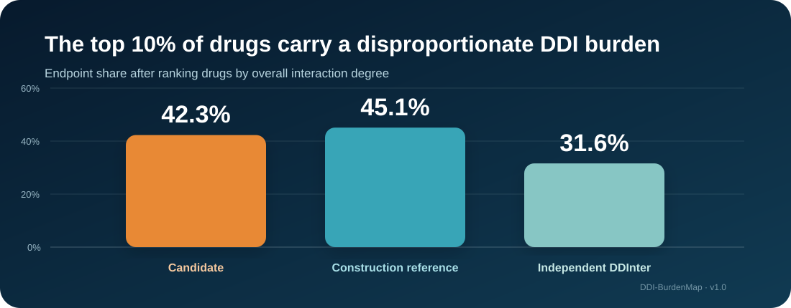
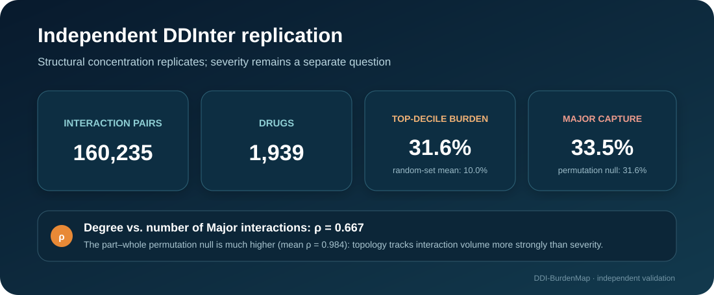

<div align="center">

# DDI-BurdenMap

### Mapping where drug-drug interaction burden concentrates - and testing whether that structure reaches real prescribing

**A reproducible, mechanism-aware network analysis with independent structural replication and patient-level validation.**

[](requirements.txt)
[](code/)
[](#patient-level-validation)
[](DATA_LICENSE_NOTICE.md)

*Companion repository for:*  
**Hub drugs concentrate drug-drug interaction burden across curated networks and real prescribing: a mechanism-aware network analysis with patient-level validation**

</div>

---

## The question

Most DDI research asks whether a **pair** of drugs interacts. DDI-BurdenMap asks a complementary systems-level question:

> **Is interaction burden spread broadly across drugs, or does it concentrate around a relatively small set of hub drugs - and does that drug-level structure reach medication combinations observed in patients?**

<p align="center">
  
</p>

## Structural results at a glance

| Network | Drugs | Pairs | Gini | Top 10% endpoint share | Giant component |
|---|---:|---:|---:|---:|---:|
| Filtered candidate network | 1,114 | 16,316 | **0.637** | **42.3%** | 99.5% |
| Construction-reference network | 1,599 | 21,897 | **0.654** | **45.1%** | 98.4% |
| Independent DDInter export | 1,939 | 160,235 | **0.503** | **31.6%** | 99.7% |

**Interpretation:** degree is a workload/connectivity signal, not a patient-level risk score and not a stand-alone severity score.

<p align="center">
  
</p>

## Patient-level validation

The revised analysis addresses the editorial request for validation in human data. **NHANES 2015-2018 is the primary external human validation cohort**; the **MIMIC-IV Demo v2.2 is an independent inpatient replication/sensitivity dataset**.

The primary endpoint deliberately does **not** require an observed medication pair to be an edge in the candidate network:

| Cohort | Primary pair universe | Top-decile watchlist | Equal-size random null | Empirical P |
|---|---:|---:|---:|---:|
| NHANES 2015-2018 | 17,229 observed co-taken pairs | **29.2%** | 16.6% | 0.00030 |
| MIMIC-IV Demo v2.2 | 9,270 temporally overlapping order pairs in candidate-drug universe | **30.8%** | 19.0% | 0.0018 |

MIMIC-IV same-admission sensitivity analysis gives 31.0% coverage at the 10% watchlist (null 18.9%, P=0.00080).

<p align="center">
  
</p>

A secondary candidate-edge subset reaches 70.0% (NHANES) and 68.0% (MIMIC-IV), but this is reported only as an **operational screening statistic**, not as independent validation, because candidate-edge membership and degree ranking share network provenance.

**Important boundary:** the random-set null controls watchlist size but is not matched on marginal prescribing frequency. These results establish reach beyond uniformly sampled equal-size candidate-drug sets; they do not establish incremental value beyond drug prevalence.

## Expert-consensus validation

The top-decile watchlist covers 77.4% of the ONC non-interruptive reference set versus 39.5% of the ONC high-priority set under an internally controlled label-permutation analysis. This is a knowledge-base alignment result, not an observed-alert-volume result.

## Reproduce the analyses

```bash
git clone https://github.com/adeebnoor/DDI-BurdenMap.git
cd DDI-BurdenMap
python -m venv .venv
source .venv/bin/activate        # Windows: .venv\Scripts\activate
pip install -r requirements.txt
```

The redistribution-safe manuscript archive contains the two fixed redistributable network inputs. Place them at:

```text
data/d3_candidate_ddi_pairs.csv
data/GoldD3R.txt
```

Then run the core network analyses with the commands documented in `code/`.

### NHANES

Obtain RXQ_RX_I, RXQ_RX_J and the optional DEMO_I/DEMO_J public-use files directly from CDC/NCHS and comply with the NCHS Data User Agreement. Then:

```bash
python code/nhanes_cohort_validation.py \
  --rx RXQ_RX_I.XPT RXQ_RX_J.XPT \
  --demo DEMO_I.XPT DEMO_J.XPT \
  --lookup code/name_to_drugbank.json \
  --candidate data/d3_candidate_ddi_pairs.csv \
  --out out/nhanes_results.json
```

### MIMIC-IV Demo

Obtain MIMIC-IV Clinical Database Demo v2.2 from PhysioNet (ODbL v1.0; DOI 10.13026/dp1f-ex47), then:

```bash
python code/mimic_cohort_validation.py \
  --prescriptions prescriptions.csv.gz \
  --patients patients.csv.gz --admissions admissions.csv.gz \
  --lookup code/name_to_drugbank.json \
  --candidate data/d3_candidate_ddi_pairs.csv \
  --out out/mimic_results.json
```

The MIMIC timestamps used here are **prescription-order intervals**, not verified administration times.

## Independent DDInter validation

DDInter source CSVs and the processed pair-level derivative are **not committed** because DDInter states a **CC BY-NC-SA 4.0** license. Reconstruct the analytical network locally using `code/prepare_ddinter_from_public.py`; see [`DATA_LICENSE_NOTICE.md`](DATA_LICENSE_NOTICE.md).

## Repository map

```text
DDI-BurdenMap/
├── assets/              # project-facing scientific visuals
├── code/                # network, DDInter and cohort scripts
├── data/README.md       # redistributable input provenance / hashes
├── out/                 # aggregate machine-readable outputs only
├── CITATION.cff
├── requirements.txt
└── DATA_LICENSE_NOTICE.md
```

## Data and license boundary

No raw NHANES, MIMIC-IV, or DDInter source files are redistributed here. No patient-level or pair-level cohort derivatives are committed. The public repository contains analysis code and aggregate outputs; the submission archive additionally contains only redistributable fixed network inputs. See [`DATA_LICENSE_NOTICE.md`](DATA_LICENSE_NOTICE.md).

## Author

**Adeeb Noor**  
Department of Information Technology, Faculty of Computing and Information Technology  
King Abdulaziz University, Jeddah, Saudi Arabia

---
<div align="center">
**DDI-BurdenMap - from pair lists to an auditable map of interaction burden and real-prescribing reach.**
</div>
