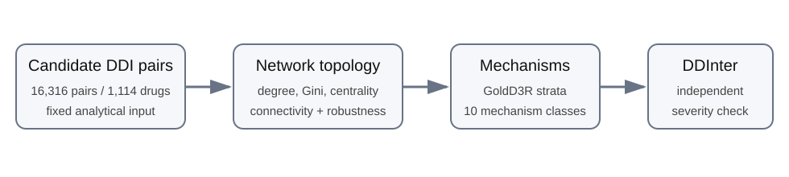

<div align="center">

# DDI-BurdenMap

### Mapping where drug-drug interaction burden concentrates

**A reproducible, severity- and mechanism-aware network analysis across candidate, reference, and independently curated DDI resources.**

[](requirements.txt)
[](code/)
[](#independent-ddinter-validation)
[](.zenodo.json)
[](DATA_LICENSE_NOTICE.md)

*Companion reproducibility repository for the manuscript:*  
**Hub drugs concentrate drug-drug interaction burden across candidate and curated networks: a severity- and mechanism-aware network analysis**

</div>

---

## The question

Most DDI work asks whether a **pair** of drugs interacts. DDI-BurdenMap asks a complementary systems-level question:

> **Is interaction burden spread broadly across drugs, or does it concentrate around a relatively small set of hub drugs?**

The project maps that structure, tests whether it survives across datasets and pharmacological mechanisms, and then asks a deliberately separate question: **does topology also enrich for severity?**

<p align="center">
  
</p>

## Results at a glance

| Network | Drugs | Pairs | Gini | Top 10% endpoint share | Giant component |
|---|---:|---:|---:|---:|---:|
| Filtered candidate network | 1,114 | 16,316 | **0.637** | **42.3%** | 99.5% |
| Construction-reference network | 1,599 | 21,897 | **0.654** | **45.1%** | 98.4% |
| Independent DDInter export | 1,939 | 160,235 | **0.503** | **31.6%** | 99.7% |

**Interpretation:** DDI burden is consistently hub-concentrated, but **degree is a workload/connectivity signal—not a patient-level risk score and not a stand-alone severity score**.

<p align="center">
  
</p>

## What makes this repository useful

- **Reproduce the paper:** candidate/reference network analyses and figures are scripted.
- **Audit the claims:** aggregate machine-readable outputs are available under `out/`.
- **Test external generalization:** DDInter is reconstructed locally from its public downloads rather than redistributed.
- **Respect data licenses:** third-party NC-SA data stay outside the repository.
- **Archive cleanly:** `CITATION.cff`, `.zenodo.json`, checksums, fixed seeds, and pinned dependencies support a versioned archival release.

## Quick start

```bash
git clone https://github.com/adeebnoor/DDI-BurdenMap.git
cd DDI-BurdenMap

python -m venv .venv
source .venv/bin/activate        # Windows: .venv\Scripts\activate
pip install -r requirements.txt

python code/candidate_network_analysis.py data/d3_candidate_ddi_pairs.csv
python code/confirmed_network_analysis.py data/GoldD3R.txt
python code/mechanism_stratified_analysis.py \
  data/GoldD3R.txt out/mechanism_topology.csv out/mechanism_topology.json
python code/reference_network_powerlaw.py data/GoldD3R.txt
```

## Independent DDInter validation

DDInter is the independent severity-aware resource used in the manuscript. Its source CSV files and the processed pair-level derivative are **not** committed here because DDInter states a **CC BY-NC-SA 4.0** license.

The repository instead reconstructs the analytical network locally from DDInter's public category downloads:

```bash
python code/prepare_ddinter_from_public.py \
  --download \
  --raw-dir data/raw_ddinter \
  --output data/ddinter2_unique.csv

python code/ddinter_severity_analysis.py \
  data/ddinter2_unique.csv \
  out/ddinter_severity_results.json
```

`data/raw_ddinter/` and `data/ddinter2_unique.csv` are explicitly blocked by `.gitignore` so licensed pair-level DDInter material is not accidentally committed.

## Study workflow

<p align="center">
  
</p>

The candidate set is treated as a **fixed analytical input**. The construction-reference network is an **internal consistency / mechanism-stratified check** because it shares upstream provenance. DDInter provides the **independent external structural replication**.

## Repository map

```text
DDI-BurdenMap/
├── assets/              # GitHub-facing visual summaries
├── code/                # analysis + figure-generation scripts
├── data/                # redistributable analytical inputs only
├── figures/             # figure source / generation notes
├── out/                 # aggregate machine-readable outputs
├── paper/               # manuscript and supplementary source
├── CITATION.cff
├── .zenodo.json
├── requirements.txt
└── CHECKSUMS.sha256
```

## Reproducibility design

Random procedures use fixed seeds recorded in the scripts. The environment is pinned in `requirements.txt`. The candidate network ranking uses pair membership only; pharmacological labels do not enter hub ranking. Mechanism-stratified analyses are reported separately, and DDInter severity is tested against explicit permutation nulls.

## Data and license boundary

This repository does **not** relicense third-party databases. DDInter source files and DDInter-derived pair-level data are not redistributed. See [`DATA_LICENSE_NOTICE.md`](DATA_LICENSE_NOTICE.md) for the exact boundary and reconstruction workflow.

## Citation

Until the journal article receives its final bibliographic citation, use the repository metadata in [`CITATION.cff`](CITATION.cff). Release `v1.0.0` is prepared for Zenodo archival; after Zenodo mints the DOI, the DOI badge and manuscript submission metadata can be updated without changing the analytical content.

## Author

**Adeeb Noor**  
Department of Information Technology, Faculty of Computing and Information Technology  
King Abdulaziz University, Jeddah, Saudi Arabia

---

<div align="center">

**DDI-BurdenMap — from pair lists to an auditable map of interaction burden.**

</div>
